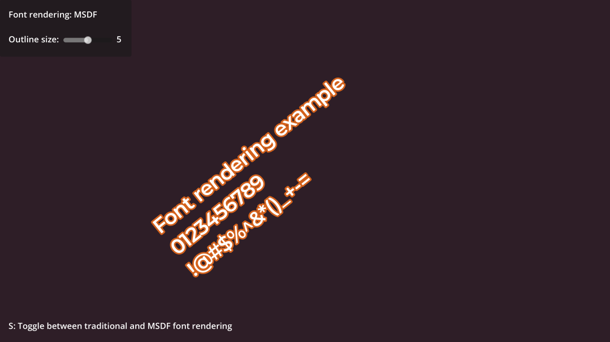

# Multi-channel Signed Distance Field Font Demo

This is a demo of Multi-channel Signed Distance Field fonts in Godot.
The technique used allows the text to remain clear under arbitrary zooms and rotations.

The *multi-channel* part refers to the font texture being generated in a way that allows
for higher precision when rendering the font. This allows MSDF fonts to be more readable
at small font sizes compared to single-channel signed distance field fonts.

Language: This demo contains no code.

Renderer: Compatibility

Check out this demo on the asset library: https://godotengine.org/asset-library/asset/2770

## Screenshots

