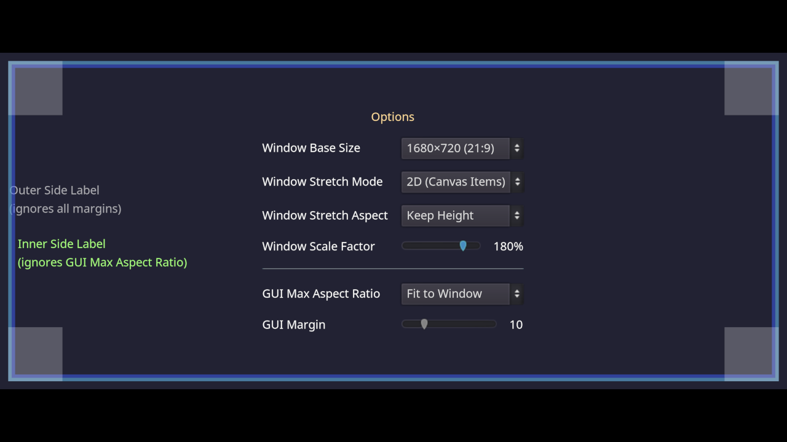

# Multiple Resolutions and Aspect Ratios

**Note:** This demo is intended to showcase what Godot can do in terms of
supporting multiple resolutions and aspect ratios. As such, this demo very
full-featured but it's also fairly complex to understand.

If you're in a hurry and want to implement *decent* support for multiple
resolutions and aspect ratios in your game, see [Multiple resolutions crash
course](#multiple-resolutions-crash-course).

___

This project demonstrates how to set up a project to handle screens of multiple
resolutions and aspect ratios.

This demo allows you to adjust the window's base resolution, stretch mode,
stretch aspect, and scale factor (internally known as "stretch shrink"). This
lets you see what happens when adjusting those properties. Make sure to resize
the project window in any direction to see the difference with the various
stretch mode and stretch aspect settings.

The GUI can be made to fit the window or constrained to a specific aspect ratio
from a list of common aspect ratios. On ultrawide aspect ratios, this can be
used to prevent HUD elements from being too spread apart, which can harm the
gameplay experience. For non-essential HUD elements, specific controls can be
made to ignore this aspect ratio constraint when it makes sense (e.g. a list of
players on the side of the screen).

Additionally, a GUI margin setting is provided to better handle TVs with an
overscan area to prevent GUI elements from being cut off. This can also improve
the gameplay experience on large monitors by bringing HUD elements closer to the
center of the screen.

A DynamicFont with multichannel signed distance field (MSDF) rendering is also used.
This allows for crisp font rendering at any resolution, without having to re-rasterize
the font when the font size changes. This makes changing the various settings in this
demo faster, especially when large font sizes are used as a result of the GUI scale factor
setting being increased.

Note that by default, Godot uses font oversampling for traditional rasterized
DynamicFonts. This means MSDF fonts are *not* required to have crisp fonts at
higher-than-default screen resolutions.

Language: GDScript

Renderer: Compatibility

Check out this demo on the asset library: https://godotengine.org/asset-library/asset/2771

## Technical notes

The demo works with the following project settings:

- `canvas_items` stretch mode (this was called `2d` in Godot 3.x).
  Recommended for most non-pixel art games.
- `expand` stretch aspect (allows support for multiple aspect ratios without
  distortion or black bars).
- Using a base window size with a 1:1 aspect ratio (`648×648` in this demo).
  This prevents GUI elements from automatically shrinking, even in portrait
  mode.
  - With this setting, to prevent the GUI from breaking at narrow aspect ratios,
    the GUI must be designed to work with a 1:1 aspect ratio. This is not
    feasible in most complex games, so a base window size with a wider aspect
    ratio (such as 4:3 or 16:10) can be used instead. The wider the aspect
    ratio, the easier design becomes, but the GUI will automatically become
    smaller at narrow aspect ratios unless the user overrides its scale with the
    stretch shrink setting. Many devices such as the Steam Deck and MacBooks
    feature 16:10 displays, so it's recommended to use a 16:10 resolution or
    narrower as a base window size to ensure a good gameplay experience out of
    the box on those devices.
- Using a window size override with a 16:9 aspect ratio (`1152×648` in this demo).
  This way, the project starts in a 16:9 window even if the base window size has
  a 1:1 aspect ratio.
  - The test window height matches the width and height of the base window size,
    so GUI elements are still at the same size.

## Multiple resolutions crash course

**Not everything in this demo is critical to all games.** For gamejam projects or mobile games, most of this can be skipped.
See the [Common use case scenarios](https://docs.godotengine.org/en/stable/tutorials/rendering/multiple_resolutions.html#common-use-case-scenarios)
section in the Multiple resolutions documentation.

With the simpler setup described in the above documentation, there are a few
limitations compared to this demo:

- The HUD will shrink when the aspect ratio becomes narrower than the base
  window size. As such, it's recommended to use a base window size with a 16:10
  aspect ratio to prevent the HUD from shrinking on Steam Deck and MacBooks.
- Players will not be able to define a margin, which can be problematic when
  playing on a TV (as overscan can obstruct some HUD elements). This can be
  worked around by ensuring the entire HUD always has a small margin around it.
  This can be done by increasing the Margin properties on all sides on the root
  Control node by 10-30 pixels or so.

If you're releasing a full-fledged game on a desktop platform such as Steam,
consider implementing full support as this demo suggests. Your players will
thank you :slightly_smiling_face:

## Screenshots

