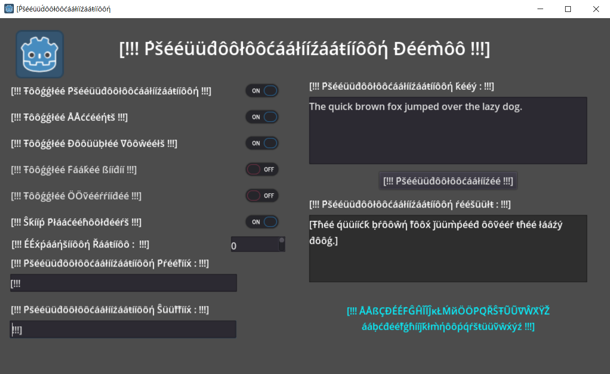

# Pseudolocalization Demo

A demo showcasing the
[pseudolocalization](https://docs.godotengine.org/en/stable/tutorials/i18n/pseudolocalization.html)
feature in Godot.

Language: GDScript

Renderer: Compatibility

Check out this demo on the Asset Store: https://store.godotengine.org/asset/godot-foundation/pseudolocalization-demo/

## Screenshots

