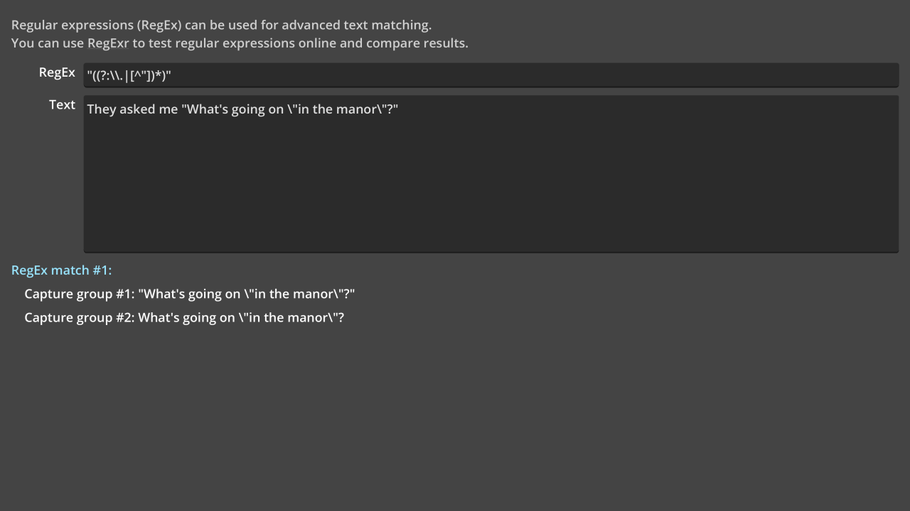

# RegEx (Regular Expressions)

A demo showing regex functionality and usage.
Can also serve as a playground for regex testing.

Language: GDScript

Renderer: Compatibility

Check out this demo on the Asset Store: https://store.godotengine.org/asset/godot-foundation/regex-regular-expressions-demo/

## Screenshots

