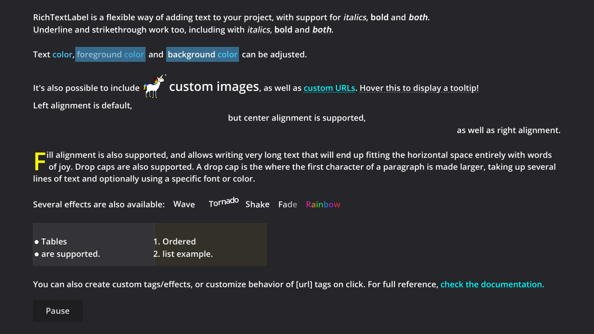

# Rich Text Label with BBCode

A demo showcasing the support for rich text and BBCode via
[`RichTextLabel`](https://docs.godotengine.org/en/latest/classes/class_richtextlabel.html).

Language: GDScript

Renderer: Compatibility

Check out this demo on the asset library: https://godotengine.org/asset-library/asset/132

## Screenshots

