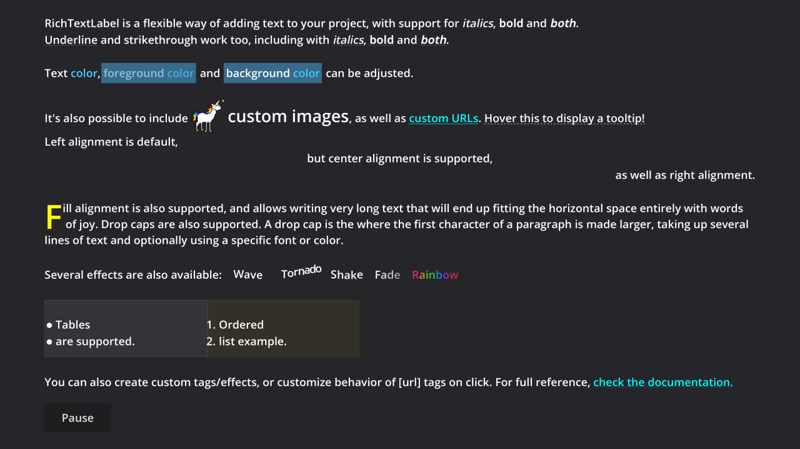

# Rich Text Label with BBCode

A demo showcasing the support for rich text and BBCode via
[`RichTextLabel`](https://docs.godotengine.org/en/latest/classes/class_richtextlabel.html).

Language: GDScript

Renderer: Compatibility

Check out this demo on the Asset Store: https://store.godotengine.org/asset/godot-foundation/rich-text-label-with-bbcode-demo/

## Screenshots

