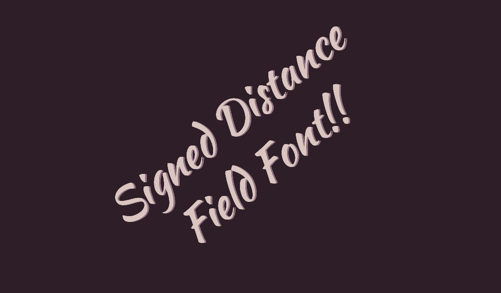

# SDF Font

This is a demo of Signed Distance Field fonts in Godot.
The technique used allows the text to remain clear
under arbitrary zooms and rotations.

Language: This demo contains no code.

Renderer: GLES 3 (this effect is not available in GLES 2)

Check out this demo on the asset library: https://godotengine.org/asset-library/asset/521

## Screenshots

