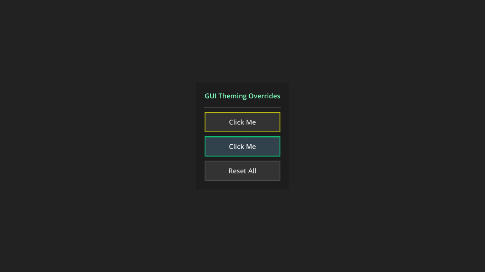

# GUI Theming Override

Demonstrates how to override GUI colors and styleboxes at runtime.

Language: GDScript

Renderer: Compatibility

Check out this demo on the asset library: https://godotengine.org/asset-library/asset/2775

## Screenshots

