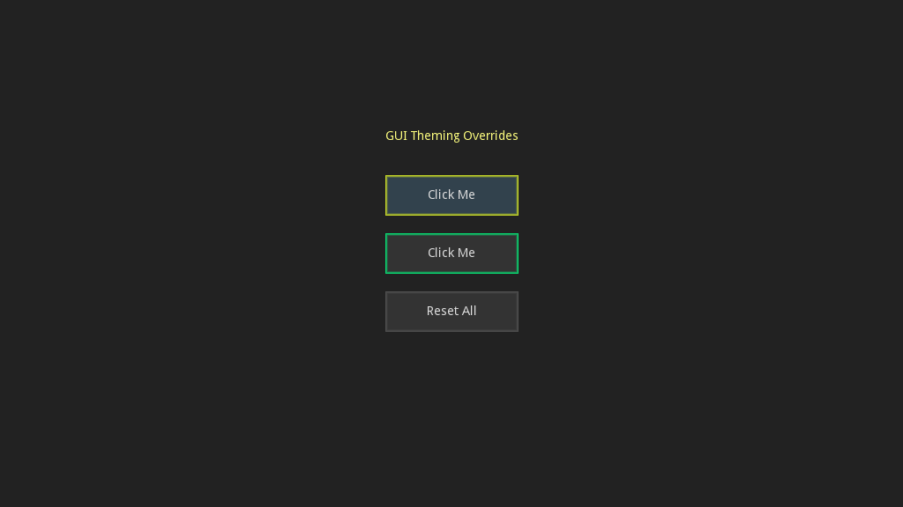

# GUI Theming Override Demo

Demonstrates how to override GUI colors and styleboxes at runtime.

Language: GDScript

Renderer: GLES 2

Check out this demo on the asset library: https://godotengine.org/asset-library/asset/786

## Screenshots

