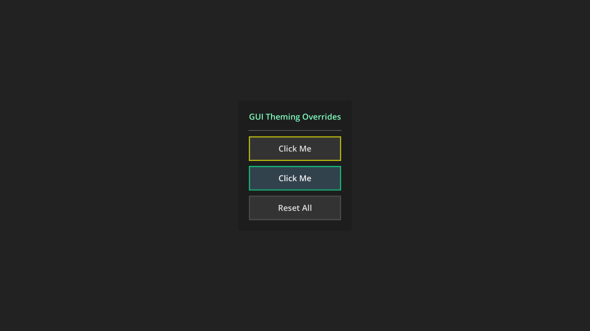

# GUI Theming Override

Demonstrates how to override GUI colors and styleboxes at runtime.

Language: GDScript

Renderer: Compatibility

Check out this demo on the Asset Store: https://store.godotengine.org/asset/godot-foundation/gui-theming-override-demo/

## Screenshots

