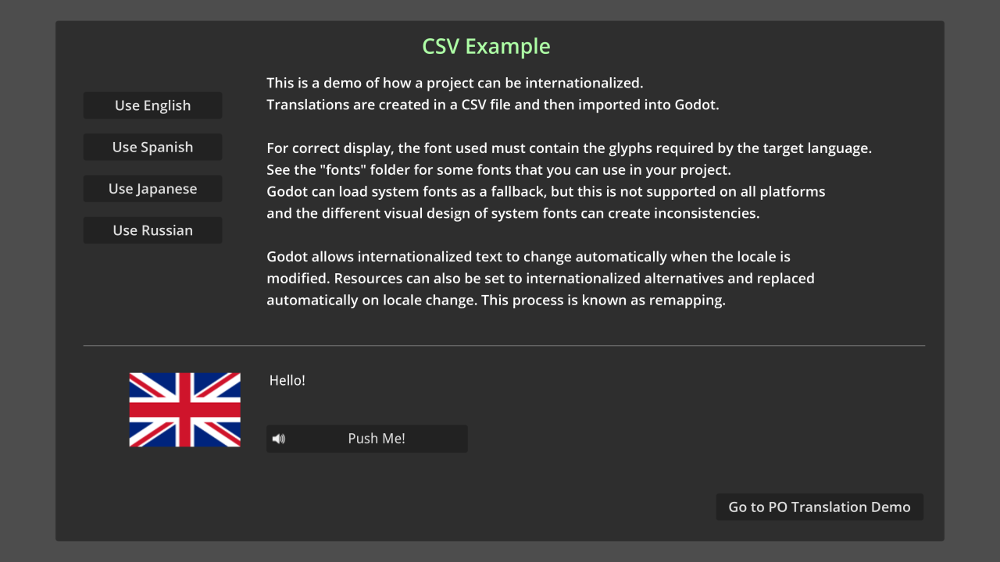

# GUI Translation Demo

This is a demo of how a project can be internationalized. Translations are
created in a CSV file and then imported into Godot.

For correct display, the font used must contain the glyphs required by the
target language. See the `fonts` folder for some fonts that you can use in your
project. Godot can load system fonts as a fallback, but this is not supported on
all platforms and the different visual design of system fonts can create
inconsistencies.

Godot allows internationalized text to change automatically when the locale is
modified. Resources can also be set to internationalized alternatives and replaced
automatically on locale change. This process is known as *remapping*.

Both CSV and gettext (PO/POT) approaches are showcased. Use the button in the
bottom-right corner to switch between the two approaches.

The resouce remapping process with PO is the same with CSV. The in-game text translation
process is also the same – use keys to fetch the appropriate translation.

The main difference between PO files and CSV files is the way both of them store
the translated data in their files.  Have a look at the `translations/po`
and `translations/csv` folders to see the files involved.

See [Internationalizing games](https://docs.godotengine.org/en/latest/tutorials/i18n/internationalizing_games.html)
and [Localization using gettext](https://docs.godotengine.org/en/latest/tutorials/i18n/localization_using_gettext.html)
for more information.

Language: GDScript

Renderer: Compatibility

## Screenshots

