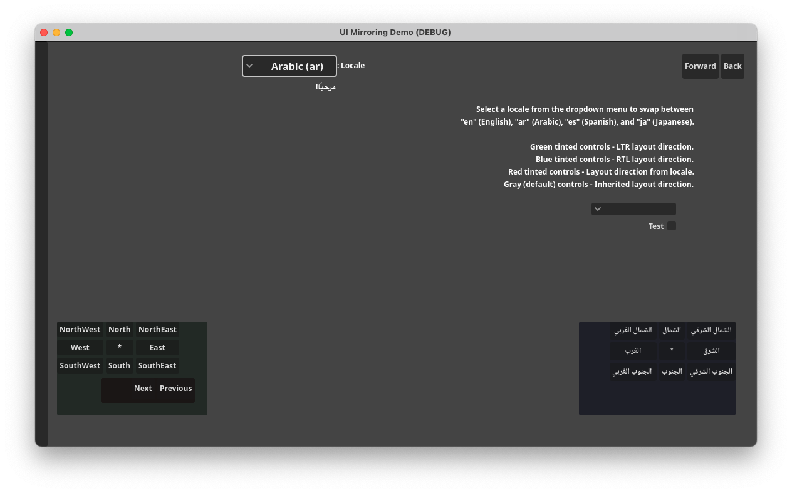
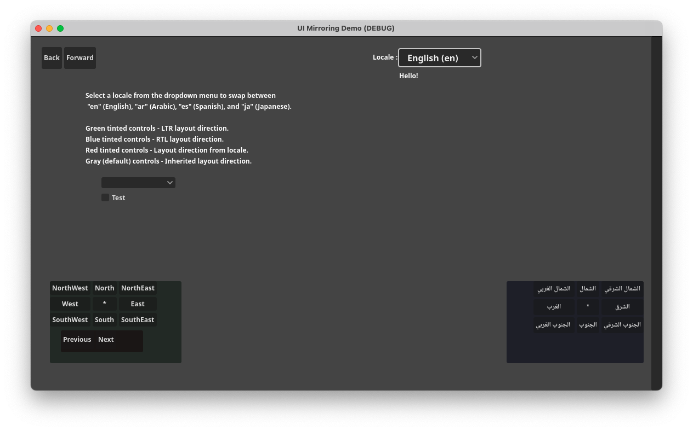

# UI Mirroring Demo

A demo showing how to use UI mirroring.

Language: GDScript

Renderer: Compatibility

Check out this demo on the Asset Store: https://store.godotengine.org/asset/godot-foundation/ui-mirroring-demo/

## Screenshots

