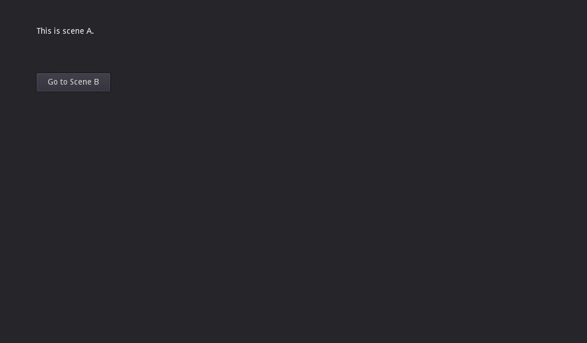

# Autoload Demo

This demo shows how to use autoloads to change between scenes.

Language: GDScript

Renderer: Compatibility

Check out this demo on the Asset Store: https://store.godotengine.org/asset/godot-foundation/autoload-demo/

## Screenshots

