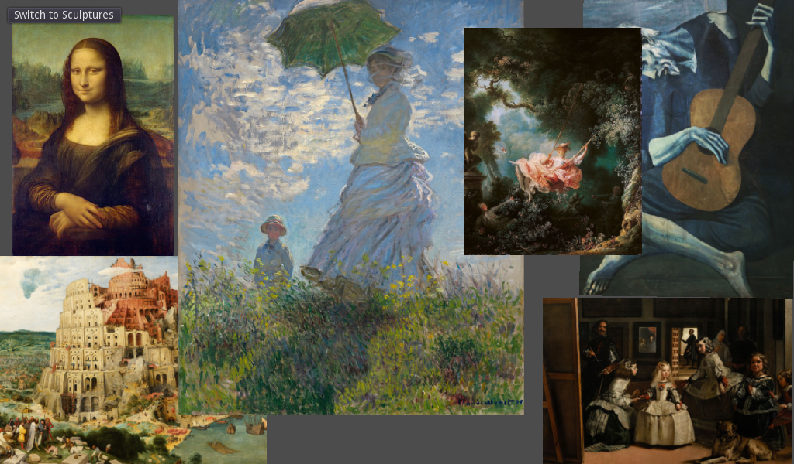

# Background Load

This is a demo showing how to use the `load_interactive()` method of
[`ResourceLoader`](https://docs.godotengine.org/en/latest/classes/class_resourceloader.html)
to load large scenes in the background with a progress bar.

Language: GDScript

Renderer: GLES 2

## Screenshots

