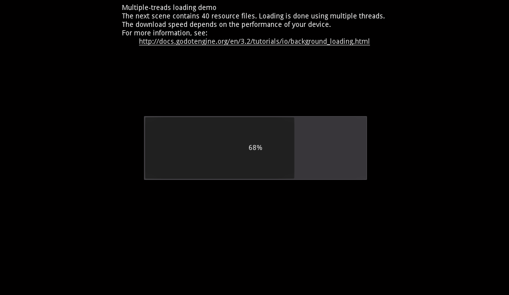

# Multiple-threads loading demo

This demo shows how you can organize
background loading using multiple threads.

Language: GDScript

Renderer: GLES 2

Check out this demo on the asset library: https://godotengine.org/asset-library/asset/582

## How does it work?

[Official documentation - Using multiple threads](http://docs.godotengine.org/en/3.2/tutorials/io/background_loading.html#using-multiple-threads)

## Screenshots

