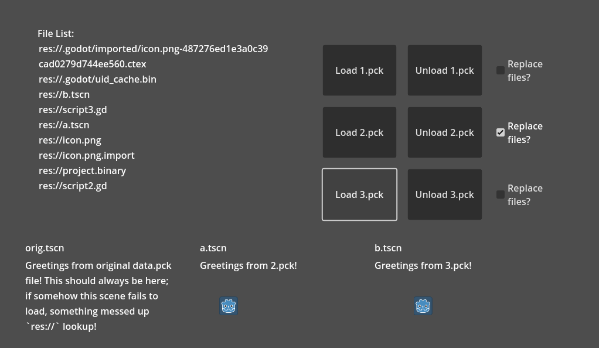

# PCK loading demo

This demo shows how you can load and unload exported PCK files at runtime.

Language: GDScript

Renderer: GLES 2

## Sub-projects

There are three Godot projects under `sub_projects`. All have been exported to their respective PCK files and are loaded by the main project.

## Screenshots

