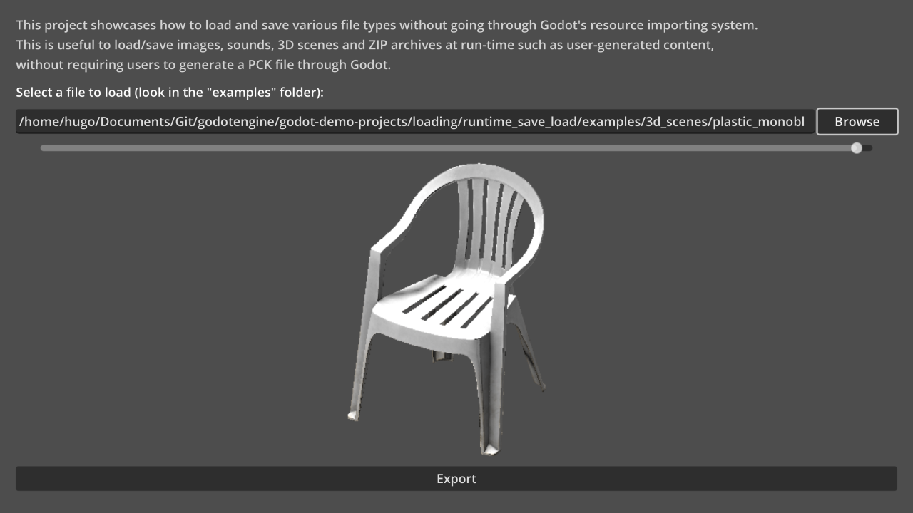

# Run-time File Saving and Loading

This project showcases how to load and save various file types without going
through Godot's resource importing system.

This is useful to load/save images, sounds, 3D scenes and ZIP archives at
run-time such as user-generated content, without requiring users to generate a
PCK file through Godot.

Can be loaded and saved at run-time:

- Images (JPEG, PNG, WebP)
- 3D scenes (glTF 2.0)
- ZIP archives
- Plain text files[^1]

Can be loaded at run-time:

- Images (TGA, BMP, SVG[^2])
- Audio (Ogg Vorbis)
- Fonts (TTF, OTF, WOFF, WOFF2, PFB, PFM, BMFont)

[^1]: Manipulating custom binary formats is possible using the FileAccess and
PackedByteArray classes, but this is not shown in this demo.

[^2]: It is possible to procedurally generate SVG as text and save it to a file
with `.svg` extension using the FileAccess class, but this is not shown in
this demo.

See the [Saving and Loading (Serialization)](/loading/serialization/) demo for
an example of saving/loading game progress.

Language: GDScript

Renderer: Compatibility

Check out this demo on the asset library: https://godotengine.org/asset-library/asset/2779

## Screenshots

## Licenses

- Files in `examples/3d_scenes/plastic_monobloc_chair_01_1k/` are copyright
  [Poly Haven](https://polyhaven.com/a/plastic_monobloc_chair_01)
  and are licensed under [CC0 1.0 Universal](https://creativecommons.org/publicdomain/zero/1.0/).
- Files in `examples/audio/` are copyright [Red Eclipse](https://redeclipse.net)
  and are licensed under [CC BY-SA 4.0 International](https://www.creativecommons.org/licenses/by-sa/4.0/).
