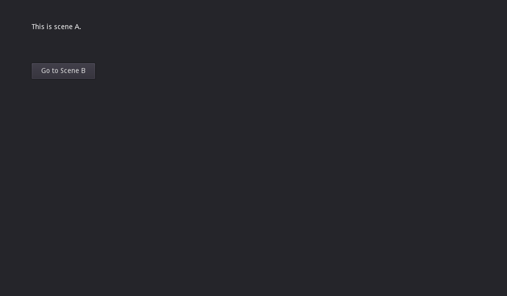

# Scene Changer

This uses two functions in SceneTree to switch between two scenes.

Language: GDScript

Renderer: Compatibility

Check out this demo on the asset library: https://godotengine.org/asset-library/asset/2780

## Screenshots

