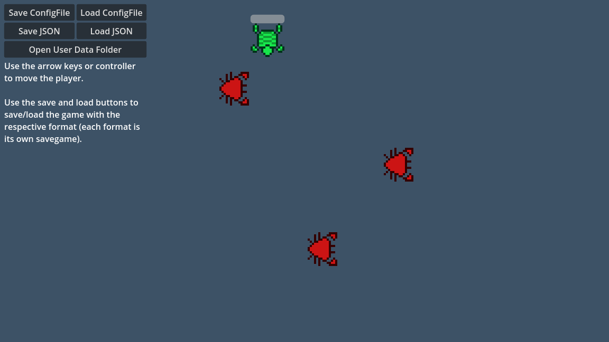

# Saving and Loading (Serialization)

This demo showcases how to save a simple game with each serialization
format supported by Godot:

- ConfigFile
- JSON

More formats may be added in the future.

For more information, see this documentation article:
https://docs.godotengine.org/en/latest/tutorials/io/saving_games.html

Language: GDScript

Renderer: GLES 2

Check out this demo on the asset library: https://godotengine.org/asset-library/asset/891

## Screenshots

