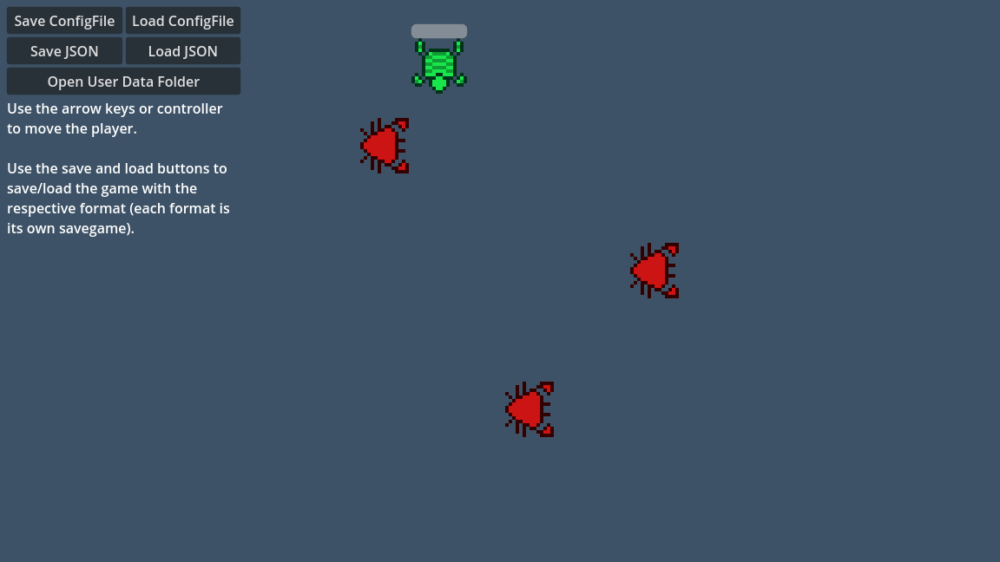

# Saving and Loading (Serialization)

This demo showcases how to save a simple game with each serialization
format supported by Godot:

- ConfigFile
- JSON

For more information, see [Saving games](https://docs.godotengine.org/en/latest/tutorials/io/saving_games.html)
in the documentation.

See the [Run-time File Saving and Loading](../runtime_save_load/) demo for
an example of loading various file types in an exported project without needing
to import them.

Language: GDScript

Renderer: Compatibility

Check out this demo on the Asset Store: https://store.godotengine.org/asset/godot-foundation/saving-and-loading-serialization-demo/

## Screenshots

