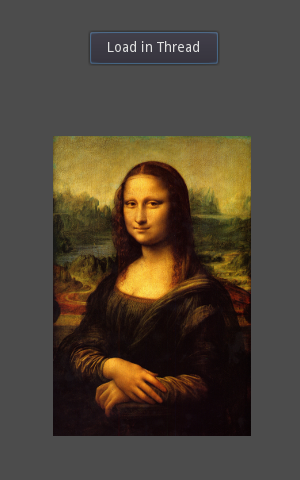

# Loading with Threads

An example using a thread to load an image.

Language: GDScript

Renderer: GLES 2

Check out this demo on the asset library: https://godotengine.org/asset-library/asset/144

## Screenshots

