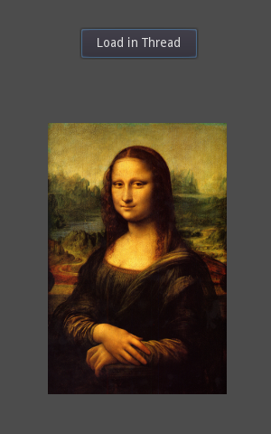

# Loading with Threads

An example using a thread to load an image.

Language: GDScript

Renderer: Mobile

Check out this demo on the Asset Store: https://store.godotengine.org/asset/godot-foundation/loading-with-threads-demo/

## Screenshots

