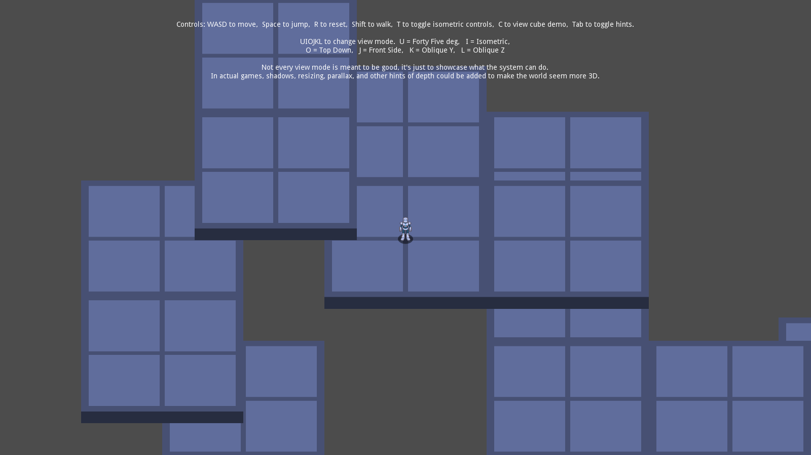
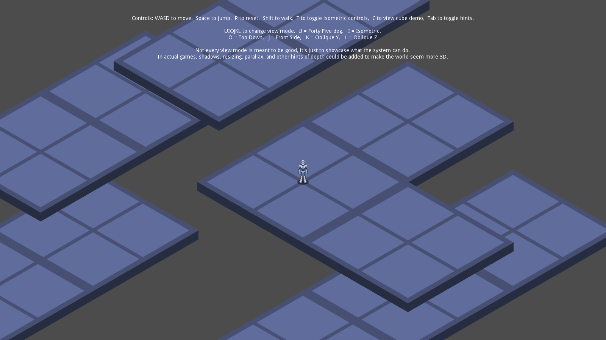
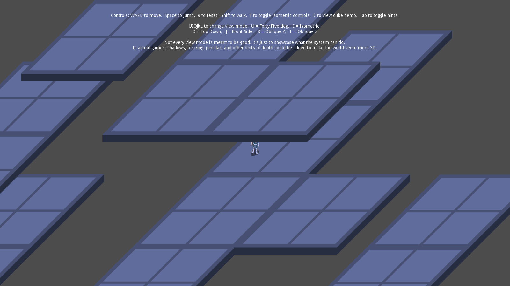
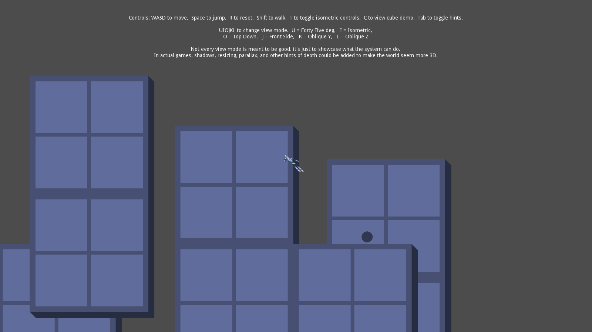
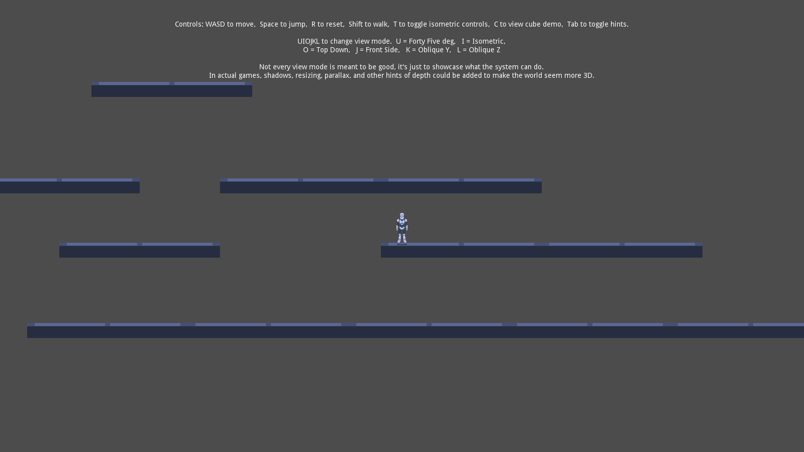
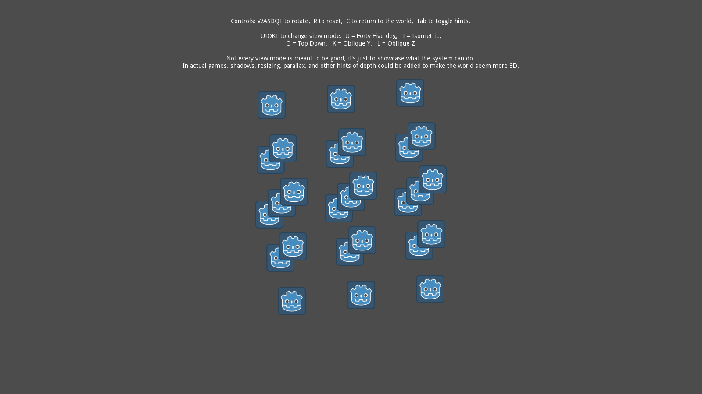
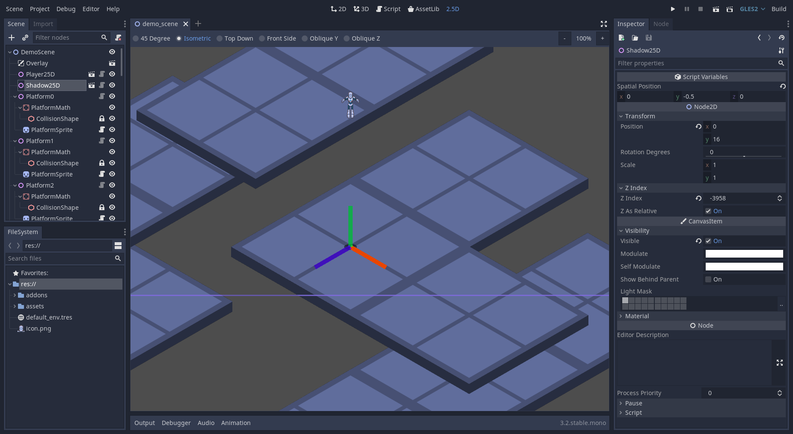

# 2.5D Demo Project with GDScript

This demo project shows a way to create a 2.5D game
in Godot by mixing 2D and 3D nodes. It also adds a
2.5D editor viewport for easily editing 2.5D levels.

Language: GDScript

Renderer: GLES 2

Note: There is a Mono C# version available [here](https://github.com/godotengine/godot-demo-projects/tree/master/mono/2.5d).

Check out this demo on the asset library: https://godotengine.org/asset-library/asset/583

## How does it work?

Custom node types are added in a Godot plugin to allow 2.5D objects. Node25D serves as the base for all 2.5D objects. Its first child must be a 3D Spatial, which is used to calculate its position. Then, add a 2D Sprite (or similar) to display the object.

Inside of Node25D, a 2.5D transformation matrix made of three `Vector2`s is used to calculate the 2D position from the 3D position. For getting a 3D position, this project uses KinematicBody and StaticBody (3D), but these only exist for math - the camera is 2D and all sprites are 2D. You are able to use any Spatial node for math.

Several view modes are implemented, including top down, front side, 45 degree, isometric, and two oblique modes. To implement a different view angle, all you need to do is create a new set of basis vectors in Node25D, use it on all instances, and of course create sprites to display that object in 2D.

The plugin also adds YSort25D to sort Node25D nodes, and ShadowMath25D for calculating a shadow (a simple KinematicBody that tries to cast downward).

## Screenshots

## Music License

`assets/mr_mrs_robot.ogg` Copyright &copy; circa 2008 Juan Linietsky, CC-BY: Attribution.
