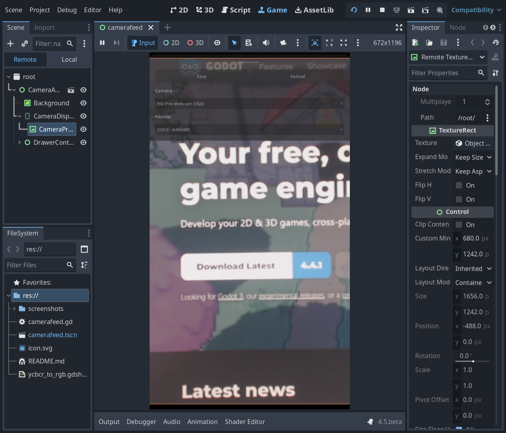

# Camera Feed Demo

A demo that shows how to display live camera feeds from various sources
using Godot's [CameraFeed](https://docs.godotengine.org/en/stable/classes/class_camerafeed.html)
and [CameraServer](https://docs.godotengine.org/en/stable/classes/class_cameraserver.html) APIs.
Supports multiple platforms including desktop, mobile, and web browsers.

Language: GDScript

Renderer: Compatibility, Mobile, Forward+

> Note: this demo requires Godot 4.5 or later

# How does it work?

The demo uses `CameraServer` to enumerate available camera devices and display their feeds in real-time. Key features include:

1. **Camera Detection**: Automatically detects all available camera feeds using `CameraServer.feeds()`.

2. **Platform Support**:
   - Handles camera permissions on mobile platforms (Android/iOS)
   - Supports web browsers with special monitoring setup
   - Works on desktop platforms with standard camera APIs

3. **Feed Formats**:
   - RGB format for standard color feeds
   - YCbCr format with shader-based conversion for certain devices
   - Dynamic format selection based on camera capabilities

4. **Real-time Display**:
   - Uses `CameraTexture` to display live camera feeds
   - Handles camera rotation and orientation transforms
   - Maintains proper aspect ratio for different camera resolutions

5. **Shader Processing**:
   - Custom shader (`ycbcr_to_rgb.gdshader`) converts YCbCr feeds to RGB
   - Uses BT.709 color space conversion standard for HDTV

The UI provides controls to select cameras, choose formats, and start/stop the feed display.

## Screenshots

