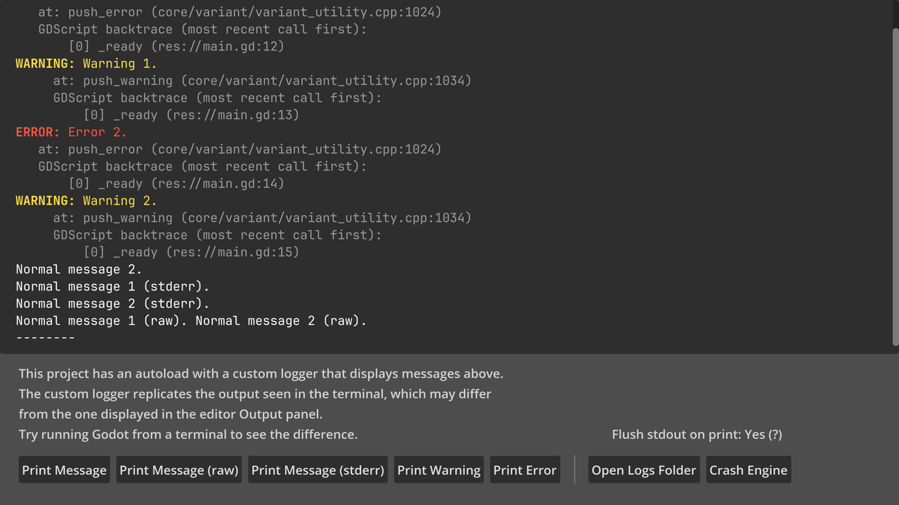

# Custom Logging

This demo showcases a custom logger implementation, which runs in parallel
with the built-in logging facilities (including file logging). The custom logger
displays all messages printed by the engine in an in-game console.

See [Logging](https://docs.godotengine.org/en/latest/tutorials/scripting/logging.html)
in the documentation for more information about configuring the engine's logging
and writing custom loggers.

Language: GDScript

Renderer: Compatibility

## Screenshots

