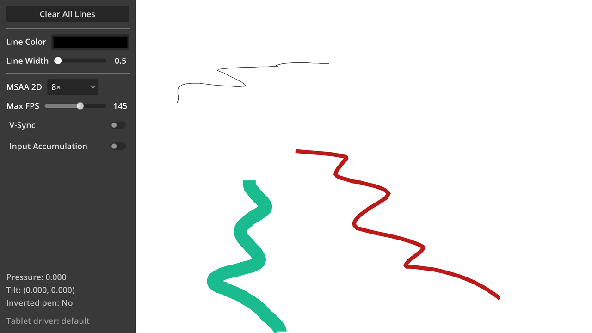

# Graphics Tablet Input

A demo showing how to use graphics tablet input in Godot. Godot has full support
for pressure sensitivity, tilt and pen inversion (i.e. checking whether the
"eraser" is being used on the pen). Note that some platforms and tablets
may not support reporting tilt.

Input accumulation and V-Sync are disabled by default in this demo to minimize
input lag and get crisp lines (even at low FPS). This makes for the most
responsive drawing experience possible. You can toggle them in the sidebar to
see the difference it makes. Note that on Android, iOS and Web platforms, V-Sync
is forced at a system level and cannot be disabled.

Lines are drawn using the Line2D node. Every time you lift off the open and start a new
line, a new Line2D node is created. Line antialiasing is provided by enabling 2D MSAA
in the Project Settings.

Mouse input can also be used to draw in this demo, but using a tablet is recommended.

> [!NOTE]
>
> If you experience issues on Windows, try changing the tablet driver in the Project
> Settings to **wintab** instead of the default **winink**. Also, try changing your
> tablet's input mode from relative to absolute mode.

Language: GDScript

Renderer: Mobile

## Screenshots

