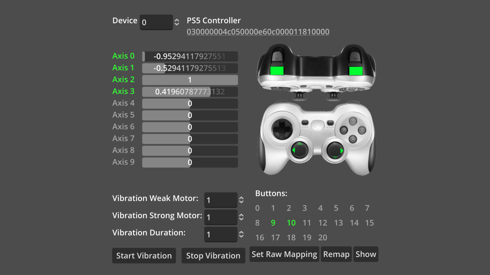

# Joypads Demo

A tool for testing
[joypad input](https://docs.godotengine.org/en/latest/tutorials/inputs/controllers_gamepads_joysticks.html)
and generating controller mapping strings.

Language: GDScript

Renderer: Compatibility

Check out this demo on the Asset Store: https://store.godotengine.org/asset/godot-foundation/joypads-demo/

## Screenshots

