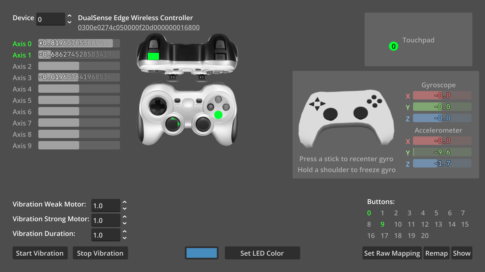
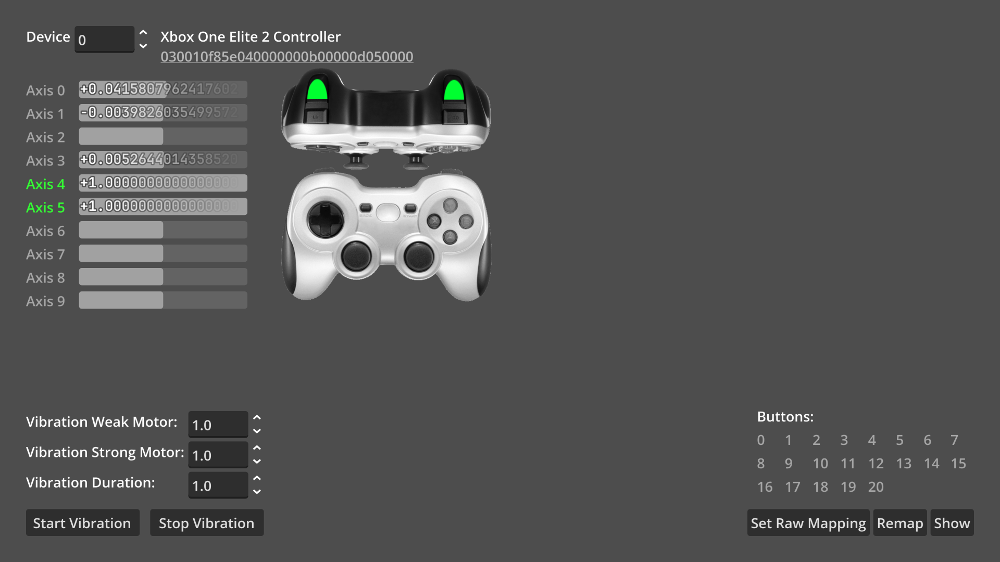

# Joypads Demo

A tool for testing
[joypad input](https://docs.godotengine.org/en/latest/tutorials/inputs/controllers_gamepads_joysticks.html)
and generating controller mapping strings.

This tool can also be used to test gyroscope, accelerometer, controller LED, and touchpads.
These additional features are only visible on screen if supported by the controller and platform.

Language: GDScript

Renderer: Compatibility

Check out this demo on the Asset Store: https://store.godotengine.org/asset/godot-foundation/joypads-demo/

## Screenshots

## Licenses

- `controller.glb` is Copyright &copy; 2026-present Hugo Locurcio and is licensed under CC0 1.0 Universal.
