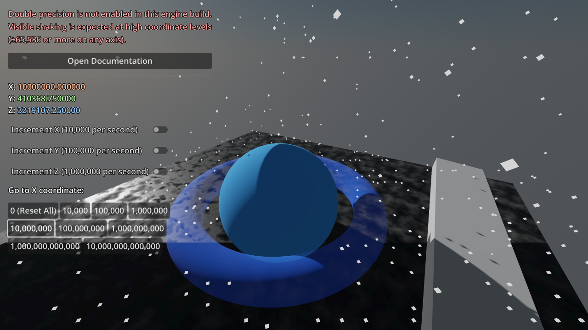
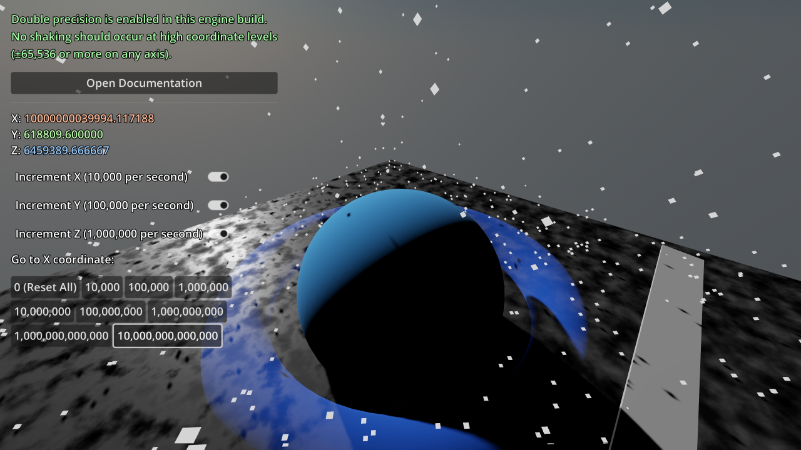

# Large World Coordinates

This project showcases optional support for double-precision rendering
and physics in action.

When using a *single-precision* build, precision errors can be noticeable as soon
as you're more than a few thousand units away from the world origin.

When using a *double-precision* build, meshes will remain stable even when very
far away from the world origin (billions of units away or more).

See the
[Large world coordinates documentation](https://docs.godotengine.org/en/latest/tutorials/physics/large_world_coordinates.html)
for more information.

> **Warning**
>
> Official Godot builds do **not** have double-precision support enabled for performance reasons.
> You need to compile a custom engine build to use double precision support.

Languages: GDScript

Renderer: Mobile

Check out this demo on the asset library: https://godotengine.org/asset-library/asset/2786

## Screenshots

