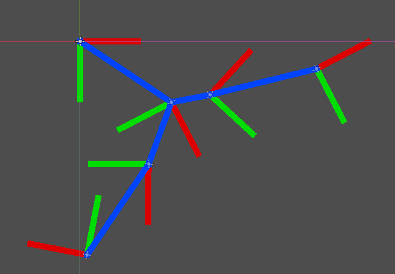
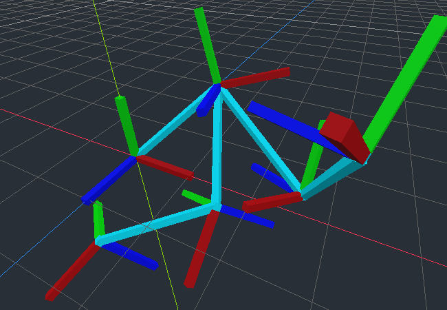

# Matrix Transform

This demo project is a playground where you can visualize how transforms work.

Do not "run" this project. You are only meant to use it within the Godot editor.

For more information, see the [Matrices and Transforms](https://docs.godotengine.org/en/latest/tutorials/math/matrices_and_transforms.html) article.

Language: GDScript

Renderer: Compatibility

Check out this demo on the asset library: https://godotengine.org/asset-library/asset/2787

## How does it work?

In both 2D and 3D, colored lines are drawn indicating the basis vectors as well as the origin vector. For 3D, this means cuboids. If you translate, rotate, scale, or shear the AxisMarker objects, you will be able to see how it affects the transform's component vectors, and all children objects are also appropriately transformed.

You are encouraged to manipulate the AxisMarker objects both in the main viewport and in the inspector. You are encouraged to duplicate them in the hierarchy and parent them any way you wish.

In 2D, red and green lines represent the X and Y axes, with blue representing the origin.

In 3D, red, green, and blue lines represent the X, Y, and Z axes, with cyan representing the origin.

One noteworthy implementation detail: to avoid jitter, the origin vector is a parent of a Node, and inherits the AxisMarker's parent's transform.

## Screenshots

