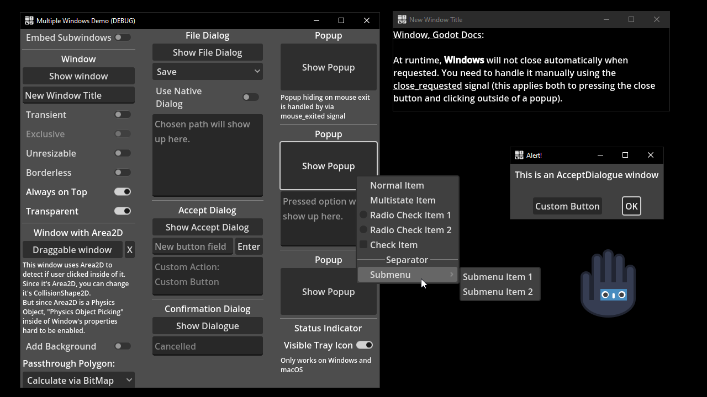

# Window Management

A demo showing all [`Window`](https://docs.godotengine.org/en/stable/classes/class_window.html) classes and their use within the main window.

It includes:
- Embedding/unembedding subwindows.
- Using a transparent window.
- Adding physical objects to new windows.
- Showcase of all Dialog Windows.
- Showcase of all Popup Windows.
- Adding elements to a PopupMenu.
- Adding an icon to the system tray.

Language: GDScript

Renderer: Compatbility

Check out this demo on the Asset Store: https://store.godotengine.org/asset/godot-foundation/multiple-windows-demo/

## Screenshots

