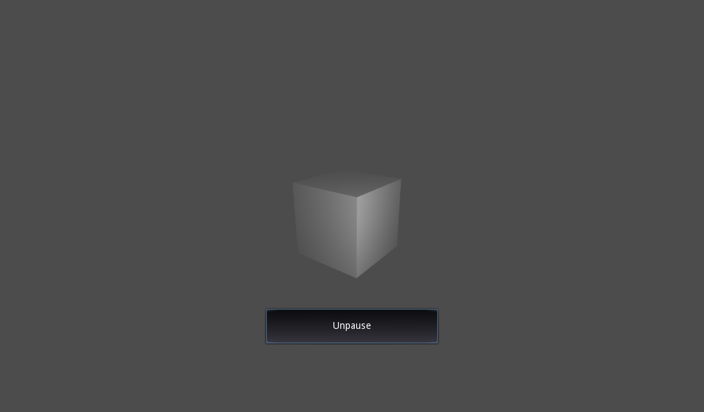

# Pause Demo

A demo showing how a game made in Godot can be paused.

Language: GDScript

Renderer: Compatibility

Check out this demo on the asset library: https://godotengine.org/asset-library/asset/2790

## Screenshots

