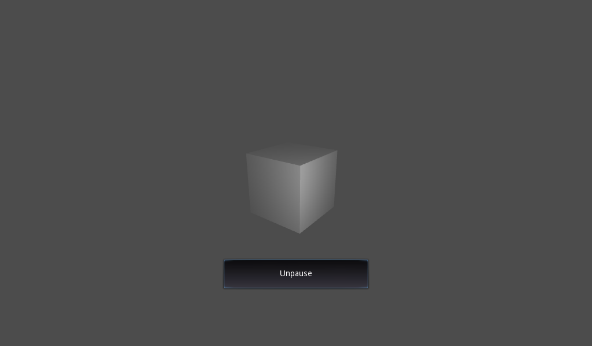

# Pause Demo

A demo showing how a game made in Godot can be paused.

Language: GDScript

Renderer: Compatibility

Check out this demo on the Asset Store: https://store.godotengine.org/asset/godot-foundation/pause-demo/

## Screenshots

