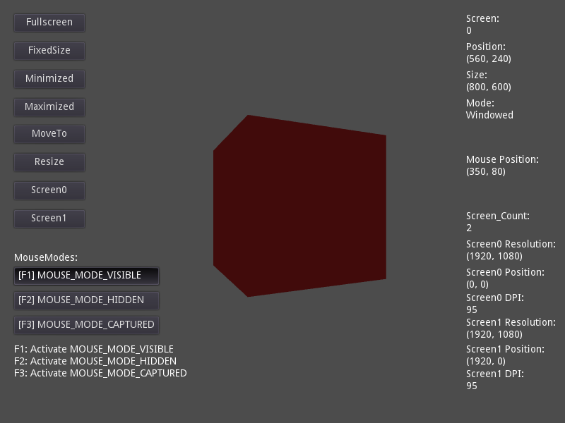

# Window Management

A demo showing the various window management features available through
[`OS`](https://docs.godotengine.org/en/latest/classes/class_os.html).

- Moving the window.
- Making it resizeable / nonresizeable and setting its size.
- Minimizing and maximizing.
- Moving the window around.
- Capturing or hiding the mouse.
- Getting various information about the screens, including DPI.

Language: GDScript

Renderer: GLES 2

Check out this demo on the asset library: https://godotengine.org/asset-library/asset/145

## Screenshots

