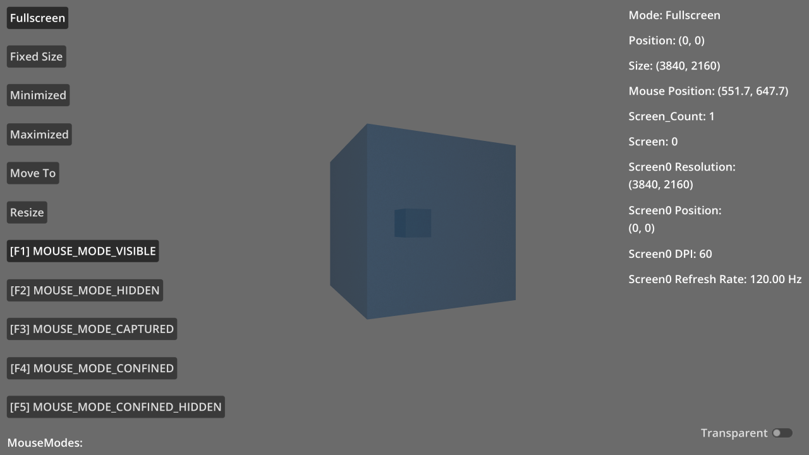

# Window Management

A demo showing the various window management features available through
[`DisplayServer`](https://docs.godotengine.org/en/latest/classes/class_displayserver.html).

- Moving the window.
- Making it resizeable / nonresizeable and setting its size.
- Minimizing and maximizing.
- Moving the window around.
- Making the window transparent.
- Capturing, hiding or confining the mouse.
- Getting various information about the screens, including DPI and refresh rate.

Language: GDScript

Renderer: Compatbility

Check out this demo on the asset library: https://godotengine.org/asset-library/asset/2791

## Screenshots

