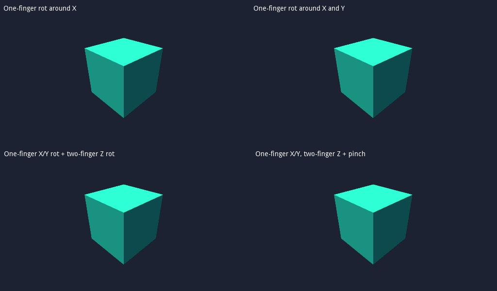

# Multitouch Cubes Demo

Demo of multitouch input and different gestures using the touch API. This demo is meant to be used with a touch-enabled device such as a phone or tablet.

Language: GDScript

Renderer: GLES 2

Check out this demo on the asset library: https://godotengine.org/asset-library/asset/141

## Screenshots

