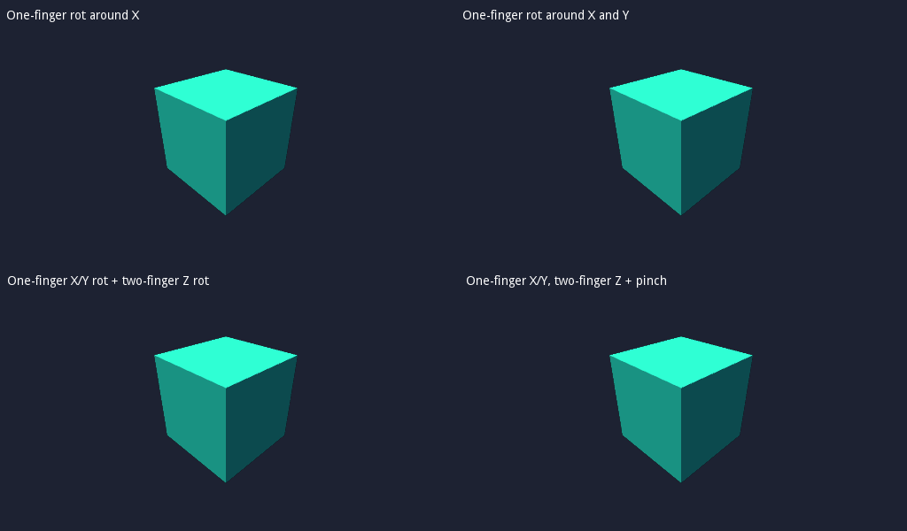

# Multitouch Cubes Demo

Demo of multitouch input and different gestures using the touch API. This demo is meant to be used with a touch-enabled device such as a phone or tablet.

Language: GDScript

Renderer: Compatibility

Check out this demo on the Asset Store: https://store.godotengine.org/asset/godot-foundation/multitouch-cubes-demo/

## Screenshots

