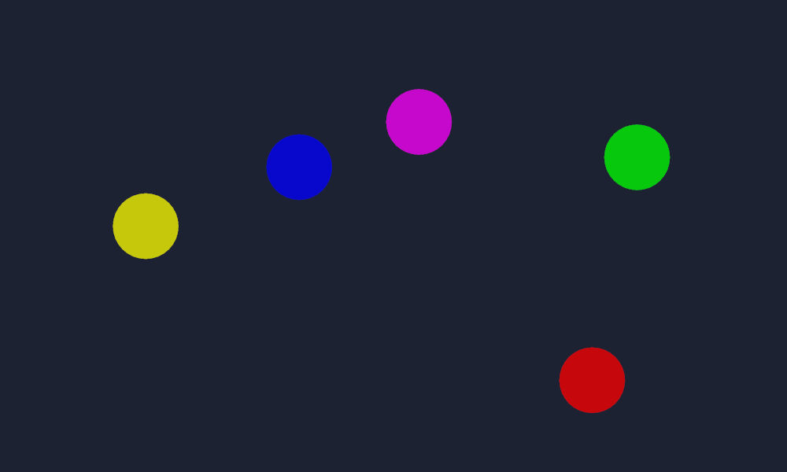

# Multitouch View with GDScript

Simple debugger for multitouch input. Shows colored dots everywhere you press.

Language: GDScript

Renderer: GLES 2

Note: There is a VisualScript version available [here](https://github.com/godotengine/godot-demo-projects/tree/master/visual_script/multitouch_view).

Check out this demo on the asset library: https://godotengine.org/asset-library/asset/142

## Screenshots

