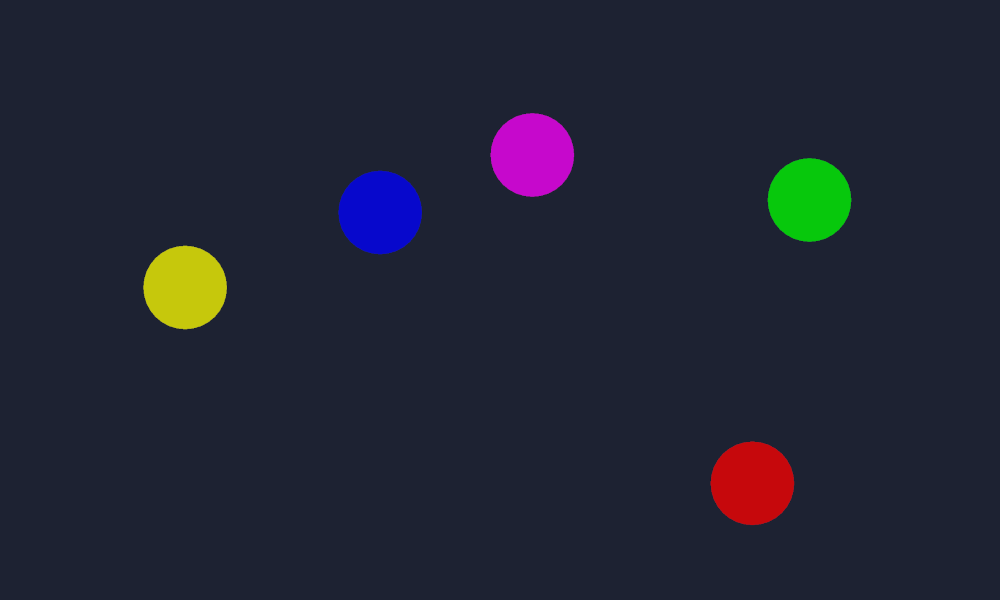

# Multitouch View with GDScript

Simple debugger for multitouch input. Shows colored dots everywhere you press.

Language: GDScript

Renderer: Compatibility

Check out this demo on the Asset Store: https://store.godotengine.org/asset/godot-foundation/multitouch-view-demo/

## Screenshots

