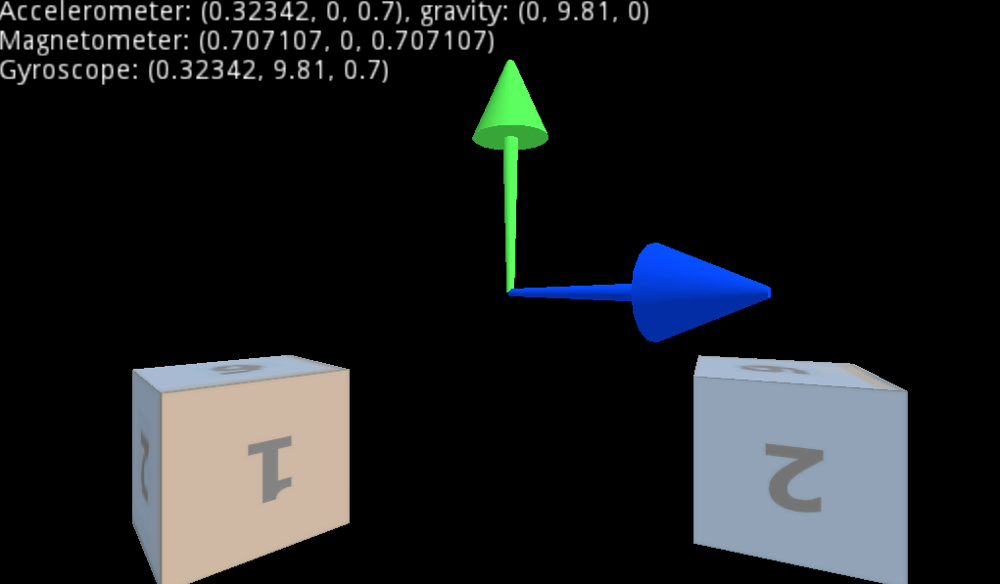

# Mobile Sensors Demo

A demo showing the use of various sensors: an accelerometer, a gyroscope, and a magnetometer.
These sensors are typically found on mobile devices, so don't expect this to work on a desktop.

Language: GDScript

Renderer: GLES 2

Check out this demo on the asset library: https://godotengine.org/asset-library/asset/143

## Screenshots

