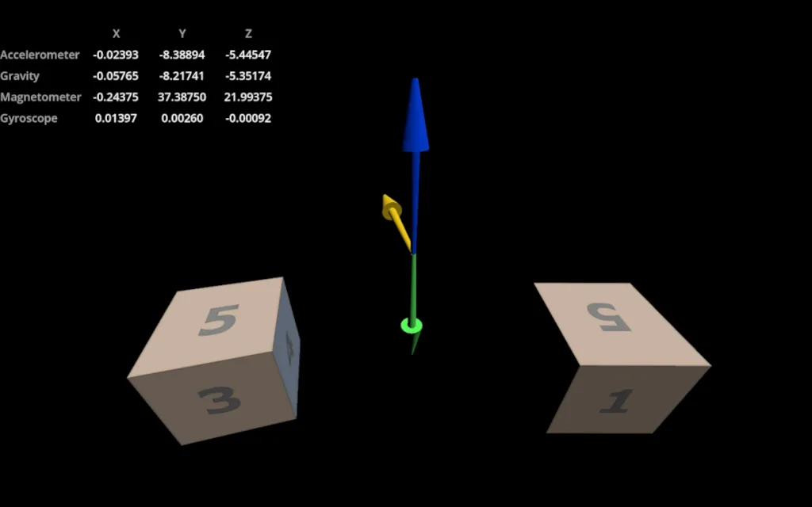

# Mobile Sensors Demo

A demo showing the use of various sensors: an accelerometer, a gyroscope, and a magnetometer.
These sensors are typically found on mobile devices, so don't expect this to work on a desktop.

Language: GDScript

Renderer: Mobile

Check out this demo on the Asset Store: https://store.godotengine.org/asset/godot-foundation/mobile-sensors-demo/

## Screenshots

