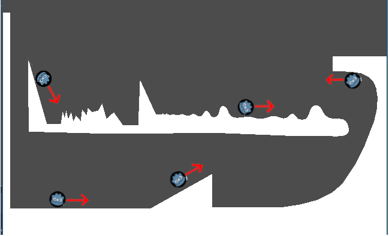

# Wheely

'Wheely' is a simple platformer with a KinematicBody2D Wheel rolling around some StaticBody2D polygon platforms. It uses C# with Godot 3.1 Mono.


## src/Player.cs

The code that controls our playter, the child class of a [`KinematicBody2D`](https://docs.godotengine.org/en/3.1/classes/class_kinematicbody2d.html). 

During the `_PhysicsProcess` call each frame, does 4 things:

```C#
this.reactToInput(delta);
this.processPhysics(delta);
this.applyPhysics(delta);
this.updateSprite(delta);
```

- `reactToInput()`
     - Sets the appropriate accelleration depending on if the user is pressing "left" or "right". A positive accelleration means a change in velocity 'forward', while a negative accelleration means a change in velocity 'backward'.

- `processPhysics()`
    - Since our `Player` is a `KinematicBody2D`, we must manually process the physics. This call processes the gravity, reacts to collisions, reacts to the accelleration, and sets the `this.velocity` field to the resultant calculated value. The most important call in this function is:
        - `calculateForwardAngle()`: Our player can move on slopes, angles, and hills. Therefore, a "forward" direction doesn't always mean "to the right". "Forward" is always defined as the `Normal` of the collision added to (`PI` / 2) radians. The red arrow in the below diagram shows the direction of "forward" in a few senarios of the original `screenplay.gif` image.
            - 

- `applyPhysics()`
    - Applies the `this.velocity` previously calculated by calling the `KinematicBody2D`'s `MoveAndSlide()` function

- `updateSprite()`
    - Makes the wheel rotate in the direction of accelleration.

## src/VisiblePlatform.cs

Some very simple code that forces CollisionPolygon2D's to be visible when playing our game.

## scenes/main.tscn

The main scene containing our Player and the 2 Platforms to interact with.
