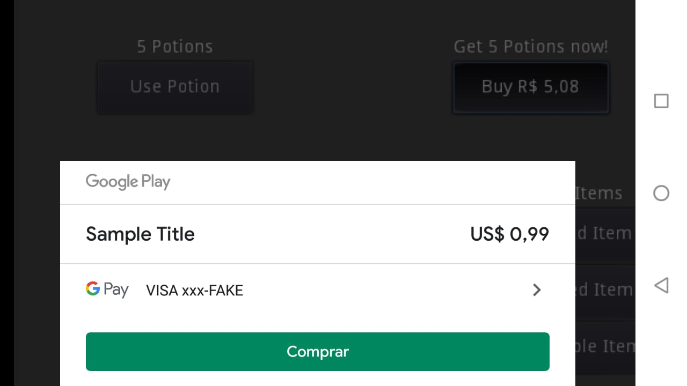
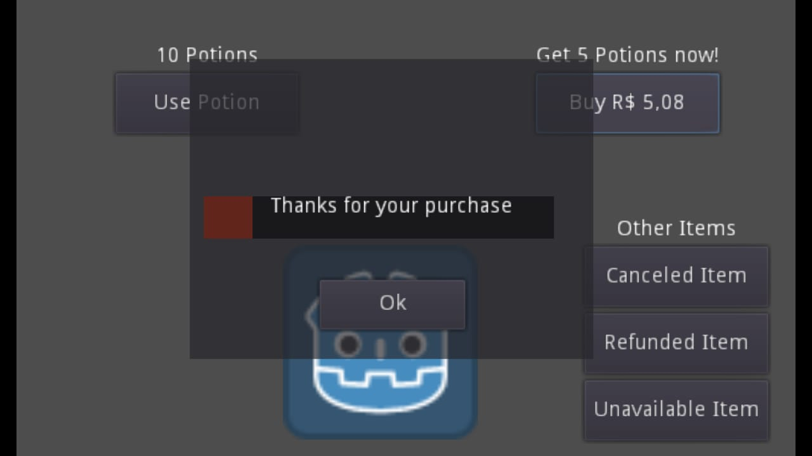

# Android IAP with C#

A simple Android IAP game. This demo shows how to buy a product and consume it for game development in Godot, including
[Android in-app purchases](https://docs.godotengine.org/en/latest/tutorials/platform/android_in_app_purchases.html).

Language: [C#](https://docs.godotengine.org/en/latest/getting_started/scripting/c_sharp/index.html)

Renderer: GLES 2

Note: There is a GDScript version available, but it's a bit simpler [here](https://github.com/godotengine/godot-demo-projects/tree/master/mobile/android_iap).

## How does it work?

You have to use potions to heal the fake Player and you have only 5 potions left, you can just buy more to keep healing the Player. The purchase is fake and won't charge anything, it uses the fake ids provided by Google.

## Screenshots

