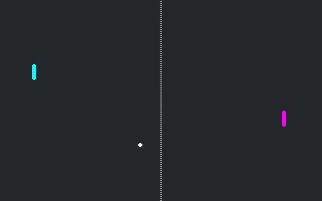

# Pong Multiplayer with C#

A multiplayer demo of Pong. One player presses "host".
The other presses "join". This only works locally.

Language: [C#](https://docs.godotengine.org/en/latest/tutorials/scripting/c_sharp/index.html)

Renderer: GLES 2

Note: There is a GDScript version available [here](https://github.com/godotengine/godot-demo-projects/tree/master/networking/multiplayer_pong).

Check out this demo on the asset library: https://godotengine.org/asset-library/asset/788

## Screenshots

