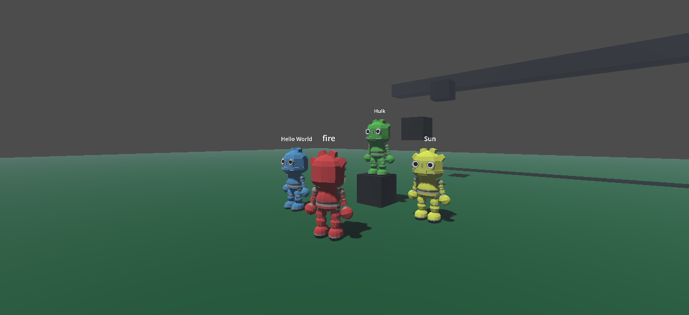

# Godot 3D Multiplayer Template

This is a template for a 3D multiplayer game developed in Godot Engine 4.3. It provides a basic structure for a multiplayer setup, where each player has a nickname displayed above their character and the option to choose from four different skins: red, green, blue, or yellow.
 
This template is also available in the [Godot Asset Library](https://godotengine.org/asset-library/asset/3377).

## Controls

* <kbd>W</kbd> <kbd>A</kbd> <kbd>S</kbd> <kbd>D</kbd> to move.
* <kbd>Shift</kbd> to run.
* <kbd>Space</kbd> to jump.
* <kbd>Esc</kbd> to quit.

Note: To test multiplayer locally, follow these steps:
Go to `Debug` > `Customize Run Instances`, then enable `Enable Multiple Instances` and set the number of instances to run simultaneously. In this template, the host is not treated as a player.

## Screenshots

## Credits

* 3D-Godot-Robot-Platformer-Character - https://github.com/AGChow/3D-Godot-Robot-Platformer-Character (CC0)
