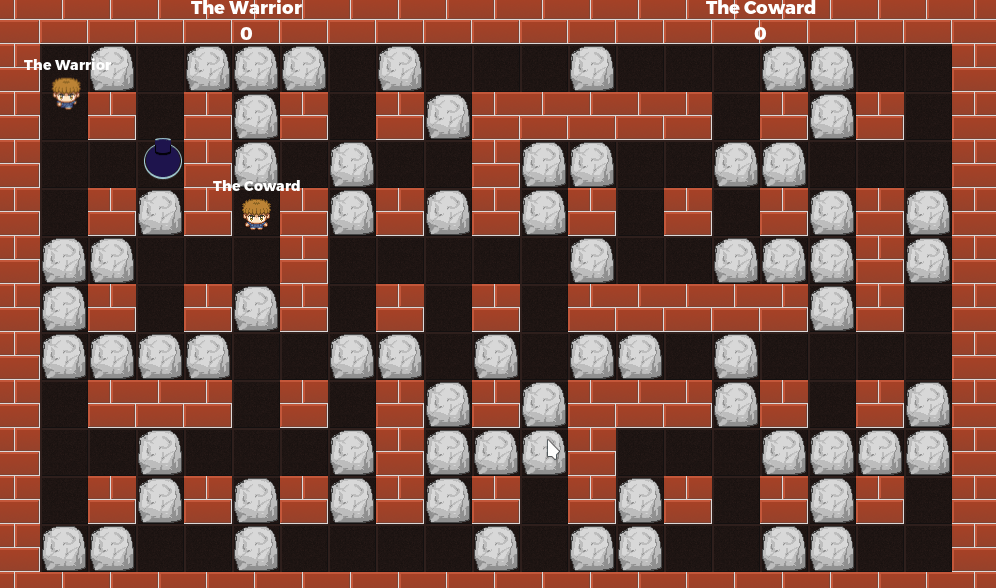

# Multiplayer Bomber

A multiplayer implementation of the classical bomberman game.
One of the players should press "host", while the other
should type in his address and press "play".

Language: GDScript

Renderer: GLES 3

Check out this demo on the asset library: https://godotengine.org/asset-library/asset/139

## Screenshots

