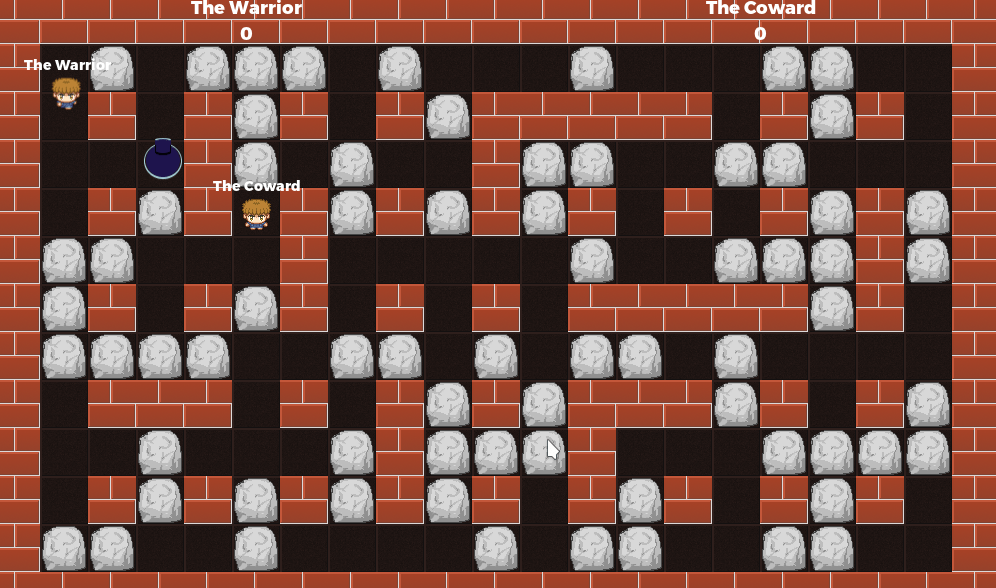

# Multiplayer Bomber

A multiplayer implementation of the classic bomberman game.
One of the players should press **Host**, while other player(s)
should type in the host's IP address and press **Join**.

Language: GDScript

Renderer: Compatibility

Check out this demo on the Asset Store: https://store.godotengine.org/asset/godot-foundation/multiplayer-bomber-demo/

## Screenshots

