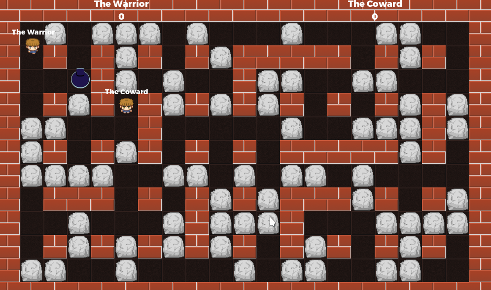

# Multiplayer Bomber with C#

A multiplayer implementation of the classic bomberman game.
One of the players should press **Host**, while other player(s)
should type in the host's IP address and press **Join**.

C# translation of https://github.com/godotengine/godot-demo-projects/tree/master/networking/multiplayer_bomber

Language: C#

Renderer: Compatibility

Check out this demo on the asset library: https://godotengine.org/asset-library/asset/2797

## Screenshots

