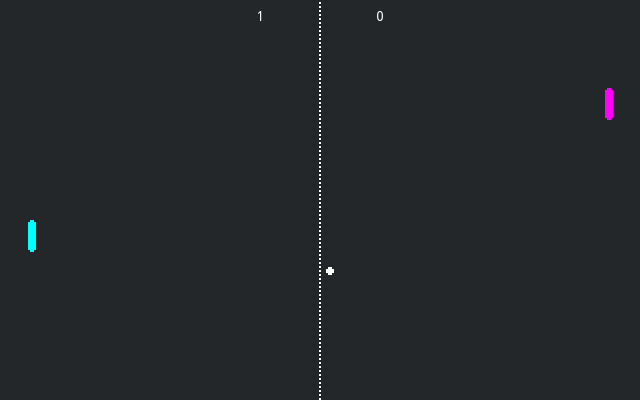

# Pong Multiplayer

A multiplayer implementation of the classic pong game.
One of the players should press **Host**, while the other
should type in the host's IP address and press **Join**.

Language: GDScript

Renderer: Compatibility

Check out this demo on the Asset Store: https://store.godotengine.org/asset/godot-foundation/pong-multiplayer-demo/

> [!NOTE]
>
> The non-multiplayer version is available [here](https://github.com/godotengine/godot-demo-projects/tree/master/2d/pong).

## Screenshots

