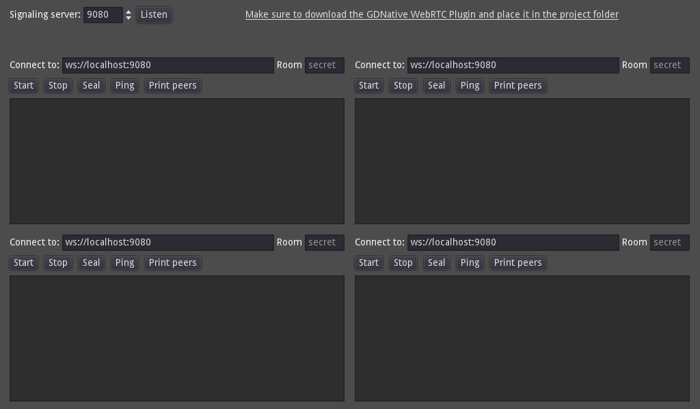

# A WebSocket signaling server/client for WebRTC.

This demo is devided in 4 parts:

- The `server` folder contains the signaling server implementation written in GDScript (so it can be run by a game server running Godot)
- The `server_node` folder contains the signaling server implementation written in Node.js (if you don't plan to run a game server but only match-making).
- The `client` part contains the client implementation in GDScript.
  - Itself divided into raw protocol and `WebRTCMultiplayer` handling.
- The `demo` contains a small app that uses it.

**NOTE**: You must extract the [latest version](https://github.com/godotengine/webrtc-native/releases) of the WebRTC GDExtension plugin in the project folder to run from desktop.

Language: GDScript

Renderer: Compatibility

## Protocol

The protocol is JSON based, and uses messages in the form:

```
{
  "id": "number",
  "type": "number",
  "data": "string",
}
```

With `type` being the message type, `id` being a connected peer or `0`, and `data` being the message specific data.

Messages are the following:

- `0 = JOIN`, must be sent by client immediately after connection to get a lobby assigned or join a known one (via the `data` field).
  This messages is also sent by server back to the client to notify the assigned lobby, or simply a successful join.
- `1 = ID`, sent by server to identify the client when it joins a room (the `id` field will contain the be assigned ID).
- `2 = PEER_CONNECT`, sent by server to notify new peers in the same lobby (the `id` field will contain the ID of the new peer).
- `3 = PEER_DISCONNECT`, sent by server to notify when a peer in the same lobby disconnects (the `id` field will contain the ID of the disconnected peer).
- `4 = OFFER`, sent by the client when creating a WebRTC offer then relayed back by the server to the destination peer.
- `5 = ANSWER`, sent by the client when creating a WebRTC answer then relayed back by the server to the destination peer.
- `6 = CANDIDATE`, sent by the client when generating new WebRTC candidates then relayed back by the server to the destination peer.
- `7 = SEAL`, sent by client to seal the lobby (only the client that created it is allowed to seal a lobby), and then back by the server to notify success.
  When a lobby is sealed, no new client will be able to join, and the lobby will be destroyed (and clients disconnected) after 10 seconds.

For relayed messages (i.e. for `OFFER`, `ANSWER`, and `CANDIDATE`), the client will set the `id` field as the destination peer, then the server will replace it with the id of the sending peer, and send it to the proper destination.

## Screenshots


